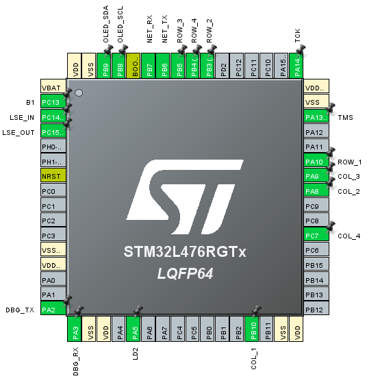

# 4100901-final-project
This repository contains the example for the final project of the course computation structures.

## Hardware prerequisites
* The example is a digital lock system featuring an STM32L4 for controling the system, an ESP8266 for interfacing with the internet, a keypad for getting the sequences, and an OLED display for GUI. See more details in the [C4Model](Doc/C4Model.md)
* The following is the pinout of the STM32:

## Firmware prerequisites
* The ESP8266 runs the esp-link [v2.2.3](https://github.com/jeelabs/esp-link/releases/tag/v2.2.3) firmware. Please follow the [serial flashing guide](https://github.com/jeelabs/esp-link/blob/master/FLASHING.md#initial-serial-flashing).
* The STM32 runs the firmware compiled from this repository using STM32CubeIDE.

## Building and Flashing
* Open the project in STM32CubeIDE.
* Compile using the current project settings.
* Use an ST-LINK to flash the firmware into the STM32.

## Functionality
El proyecto de cerradura digital, se desarrolo en IDE de STM32 para la Nucleo L476RG. Tiene como objetivo principal implementar un sistema de seguridad avanzado. Este sistema puede recibir información de dos fuentes principales: un teclado físico y un módulo ESP8266 para la comunicación inalámbrica. Una vez que el microcontrolador recibe la información de entrada, su función principal es verificar si la clave proporcionada es correcta o incorrecta. Esta verificación se lleva a cabo mediante algoritmos específicos y comparaciones de datos. Dependiendo del resultado de esta verificación, el microcontrolador tomará la decisión de mostrar un mensaje apropiado en la pantalla OLED SSD1306. Si la clave es correcta, se otorgará acceso y se mostrará un mensaje de bienvenida, mientras que si la clave es incorrecta, se denegará el acceso y se mostrará un mensaje de error correspondiente.

Los elementos clave para este proyecto son:

*The keypad: mediante este los usuarios pueden presionar estas teclas para ingresar una clave numérica o, que se utilizará para verificar la identidad del usuario y permitir o denegar el acceso.
*The Debug console: El teclado está conectado al microcontrolador STM32 Nucleo L476RG mediante líneas GPIO. Cuando se presiona una tecla en el keypad, se genera una señal eléctrica en la fila y la columna correspondientes, y el microcontrolador detecta esta señal y la interpreta como una entrada válida.
*The internet interface: Conexión a la Red Wi-Fi: El módulo ESP8266 se encarga de establecer una conexión a una red Wi-Fi local o a la red que se haya configurado previamente. Esto permite que el sistema de cerradura esté en línea y disponible para la comunicación desde dispositivos remotos.
*Interacción con la Pantalla OLED: En caso de que la clave sea correcta, el microcontrolador enviará la señal para mostrar un mensaje de bienvenida en la pantalla OLED SSD1306. Si la clave es incorrecta, se mostrará un mensaje de error correspondiente.

## Contact info
* Sam C - saacifuentesmu@unal.edu.co
